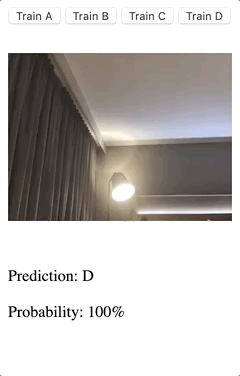

# Tensorflow.js Transfer Learning Image Classifier Example

## Description

A step-by-step description of the code is available in [Codelab on Google I/O 19](https://codelabs.developers.google.com/codelabs/tensorflowjs-teachablemachine-codelab/).
And if you want to run this example yourself, visit [https://9bow.github.io/TensorflowJS-Codelab-Transfer-Learning-Image-Classifier](https://9bow.github.io/TensorflowJS-Codelab-Transfer-Learning-Image-Classifier).

## How to experience

This example classifies images.

1. First, connect to [the site](https://9bow.github.io/TensorflowJS-Codelab-Transfer-Learning-Image-Classifier) to use this example and then grant WebCam privileges.
  (WebCam privileges are required for learning.)

2. Take a pose or something that corresponds to each class of four (A to D) and press the `Train X` button.

3. If you have studied at least once, you can see `Prediction` and `Probability` at the bottom.

4. If the `Prediction` is not correct or the `Probability` is low, add more training data. (Step 2)

## Sample

* I try to categorize the hand shape of the Rock Paper Scissors.
* A is scissors, B is a rock, C is Paper, and D is nothing.
* I train each class about fifteen or so times, and the learning result is as follows.

## More information

More Codelabs can be found at [https://codelabs.developers.google.com/io2019/](https://codelabs.developers.google.com/io2019/).

For more information on Tensorflow.js, please visit [https://www.tensorflow.org/js](https://www.tensorflow.org/js).
